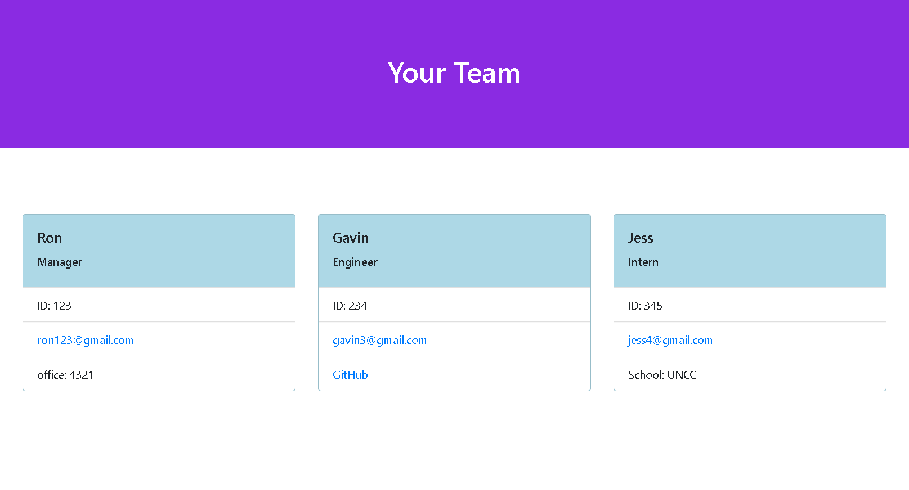

# Team-Profile-Generator

## Table of Contents
1. [Description](#description)
2. [Visuals](#visuals)
3. [Resources](#resources)

## Description

This project generates an html page for a team of employees. When the program is run, questions are asked about the manager to get details such as their name, ID, email, and office number. 

Once the manager info is complete, the user has the options to add new employees to the team. These employees can either be engineers (name, ID, email, Git Hub username) or interns (name, ID, email, school). 

Once the user is done adding team members, an index.html file is generated in the "sample" folder. When opened in a browser, this site will contain all of the employee's information in card format.

To create the cards, I used bootstrap, and to style the page a bit I added some custom CSS. 

I created a file called createPage.js to store the functions needed to generate the html. This page includes template literals with the html to be added to the index.html file. 

I also created a class called Employee, and I extended it to include Manager, Engineer, and Intern; all of these are located in the lib folder. These also contained functions, which were tested by the test pages within the test folder. 

## Visuals

Generating team profile page:

What this generates in browser:

Running Tests:

## Resources

[Git Hub Repository](https://github.com/vmalie3/team-profile-generator)

